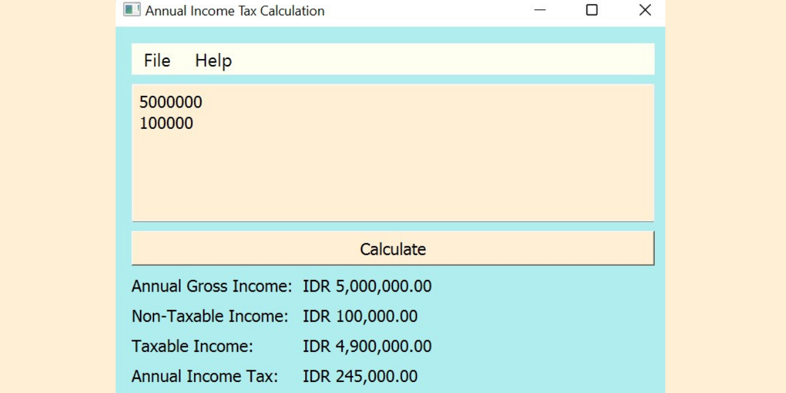

# Indonesian Payroll Tax Calculation using Python Programming Language
This is the project of the Object-Oriented and Visual Programming course. This project aims to do an Indonesian payroll tax calculation with an object-oriented and visual programming concept using the Python programming language with help of the PyQt5 library to create the GUI. 

The program accepts the annual gross income and non-taxable income from the user then, it will process the taxable income and calculates income tax from the user input. Besides that, the user can also save their input into a file .txt and even can load/open the file that is saved and directly show the result without clicking a button. The result will show the annual gross income, non-taxable income, taxable income, and income tax in the IDR format.

